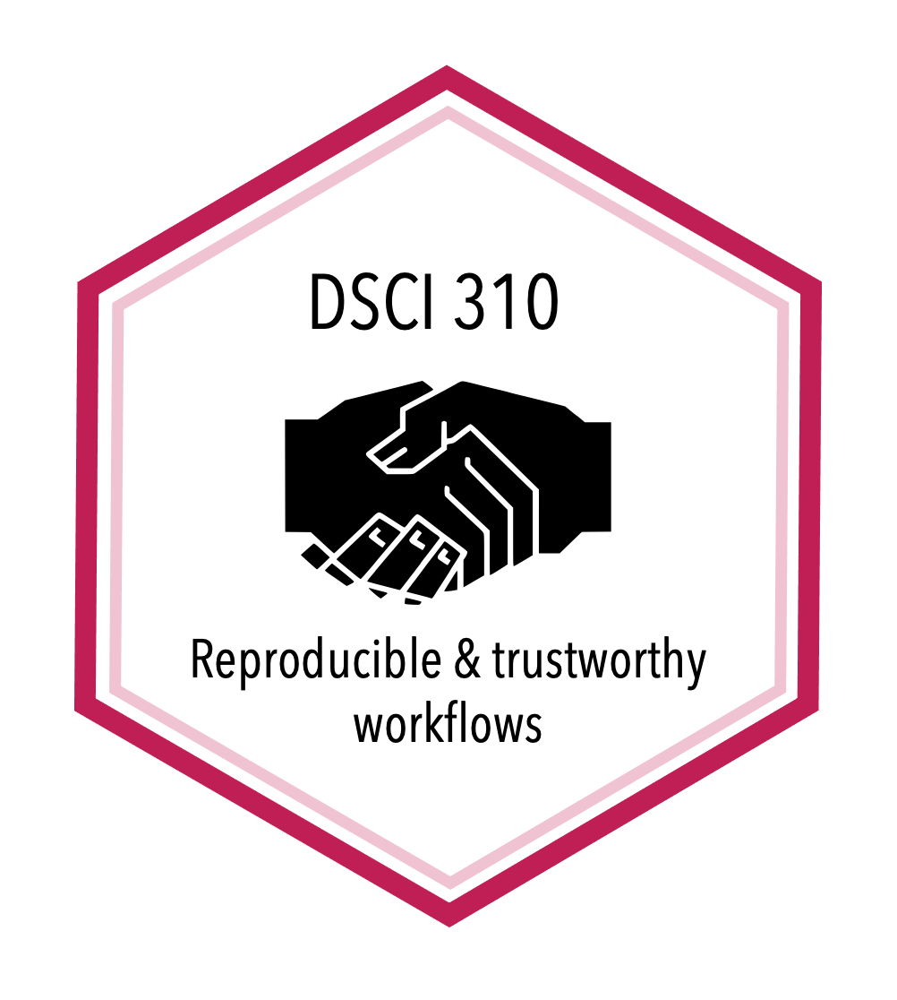

```{r setup, include=FALSE}
knitr::opts_chunk$set(echo = FALSE)

# Learn more about creating websites with Distill at:
# https://rstudio.github.io/distill/website.html

```

```{r, out.width="40%"}

```

Welcome to the course website for DSCI 310! Course-specific information is contained within this website. General resources (course notes and textbook readings) are located at the links below:

- [DSCI 310 course notes](https://github.com/UBC-DSCI/reproducible-and-trustworthy-workflows-for-data-science)
- [R packages](https://r-pkgs.org/)
- [Python packages](https://py-pkgs.org/)

We will also be using Canvas for this course. 
Please ensure you can access the DSCI 310 Canvas course shell at [canvas.ubc.ca](https://canvas.ubc.ca).
