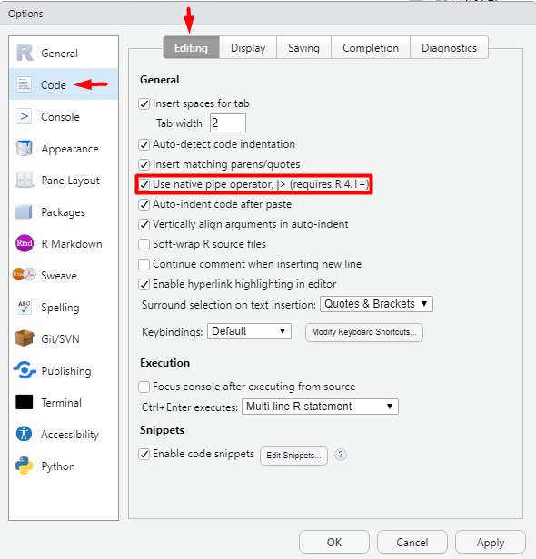

## Installation notes

If you have already installed Git, Latex, or any of the R or Python related packages
**please uninstall these and follow the instructions below to reinstall them**
(make sure to also remove any user configuration files and backup them if desired).
In order to be able to support you effectively and minimize setup issues and software
conflicts, we suggest you install the required software as specified below.

In all the sections below,
if you are presented with the choice to download either a 64-bit (also called x64)
or a 32-bit (also called x86) version of the application **always** choose the 64-bit version.

Once you have completed these installation instructions,
make sure to follow the post-installation notes at the end
to check that all software is setup correctly.

## Web browser

In DSCI 310 we will be using many tools that work most reliably on Google Chrome and Firefox
(including our online quiz software), so we recommend that you use one of these browsers.

- To install Chrome, go to [https://www.google.com/chrome/](https://www.google.com/chrome/),
    click on "Download Chrome" and follow the instructions on the website to finish the installation.
- To install Firefox, go to [https://www.mozilla.org/en-US/firefox/new/](https://www.mozilla.org/en-US/firefox/new/),
    click on "Download Firefox" and follow the instructions on the website to finish the installation.


## Bash shell

Apple recently changed the Mac default shell in the Terminal to Zsh, however,
we aim to teach with the same shell across all three operating systems we support,
which is the Bash shell. Thus, we ask that you change the default shell in your
Terminal to Bash by opening the Terminal ([how to video](https://youtu.be/5AJbWEWwnbY)) and typing:

```shell
chsh -s /bin/bash
```

You will have to quit all instances of open Terminals and then
restart the Terminal for this to take effect.

## Visual Studio Code

### Installing

The open-source text editor Visual Studio Code (VS Code) is both a powerful text editor and a full-blown Python IDE,
which we will use for more complex analysis.
You can download and install the macOS version of VS Code from the VS code website
[https://code.visualstudio.com/download](https://code.visualstudio.com/download).
Once the download is finished, click "Open with Archive utility",
and move the extracted VS Code application from "Downloads" to "Applications".
In addition to reading the [getting started instructions](https://code.visualstudio.com/docs/setup/mac),
**be sure to follow the ["Launching from the command line"](https://code.visualstudio.com/docs/setup/mac#_launching-from-the-command-line) steps as well.**

You can test that VS code is installed and can be opened from Terminal by restarting terminal and typing the following command:

```bash
code --version
```

you should see something like this if you were successful:

```bash
1.62.2
3a6960b964327f0e3882ce18fcebd07ed191b316
arm64
```

> **Note:** If you get an error message such as `-bash: code: command not found`,
> but you can see the VS Code application has been installed,
> then something went wrong with setting up the launch from the command line.
> Try following [these instructions](https://code.visualstudio.com/docs/setup/mac#_launching-from-the-command-line)
> again, in particular you might want to try the described manual method of adding VS Code to your path.

## GitHub

In DSCI 310 we will use the publicly available [GitHub.com](https://github.com/).
If you do not already have an account, please sign up for one at [GitHub.com](https://github.com/)

Sign up for a free account at [GitHub.com](https://github.com/) if you don't have one already.

## Git

We will be using the command line version of Git as well as Git through RStudio and JupyterLab.
Some of the Git commands we will use are only available since Git 2.23,
so if your Git is older than this version,
we ask you to update it using the Xcode command line tools (not all of Xcode), which includes Git.

Open Terminal and type the following command to install Xcode command line tools:

```bash
xcode-select --install
```

After installation, in terminal type the following to ask for the version:

```bash
git --version
```

you should see something like this (does not have to be the exact same version) if you were successful:

```
git version 2.30.1 (Apple Git-130)
```

> **Note:** If you run into trouble, please see that Install Git
> Mac OS section from [Happy Git and GitHub for the useR](http://happygitwithr.com/install-git.html#mac-os)
> for additional help or strategies for Git installation.

### Configuring Git user info

Next, we need to configure Git by telling it your name and email.
To do this, type the following into the terminal
(replacing Jane Doe and janedoe@example.com, with your name and email that
you used to sign up for GitHub, respectively):

```bash
git config --global user.name "Jane Doe"
git config --global user.email janedoe@example.com
```

> **Note:** To ensure that you haven't made a typo in any of the above,
> you can view your global Git configurations by either opening the
> configuration file in a text editor (e.g. via the command `code ~/.gitconfig`)
> or by typing `git config --list --global`.

### Setting VS Code as the default editor

To make programs run from the terminal (such as `git`) use vscode by default,
we will modify `~/.bash_profile`. First, open it using VS Code (this will also
create the file if it doesn't already exist):

```bash
code ~/.bash_profile
```

> **Note:** If you see any existing lines in your `~/.bash_profile`
> related to a previous Python or R installation,
> please remove these.

Now append the following lines to `~/.bash_profile`:

```bash
# Set the default editor for programs launch from terminal
EDITOR="code --wait"
VISUAL=$EDITOR  # Use the same value as for "EDITOR" in the line above

```

Then save the file and exit VS Code.

> **Note:** Most terminal programs will read the `EDITOR` environmental variable
> when determining which editor to use, but some read `VISUAL`,
> so we're setting both to the same value.

In some cases,
VScode is not set as the default text editor for git
even after appending the two lines above,
so to make sure it is registered properly,
also run the following from your terminal:

```bash
git config --global core.editor "code --wait"
```

On MacOS,
VScode sometimes reads a different configuration file than your other programs.
To avoid this,
open your `~/.bashrc` file:

```bash
code ~/.bashrc
```

And append the following lines:

```bash
if [ -f ~/.bash_profile ]; then . ~/.bash_profile; fi

```

## Python, Conda, and JupyterLab

### Python and Conda

In DSCI 310 we will be using Python and the `conda` pacakge manager.
Currently there is no official _native_ Miniconda installation for Macs with
the ARM system architecture. As an alternative, we will install the unofficial
[Miniforge platform](https://github.com/conda-forge/miniforge).
To install it, first download the
[OS X arm64 installer](https://github.com/conda-forge/miniforge/releases/latest/download/Miniforge3-MacOSX-arm64.sh).

Ensure it was placed in your "Downloads" folder.
Next, open the terminal and run the following:

```bash
bash /Users/$(whoami)/Downloads/Miniforge3-MacOSX-arm64.sh 
```

This will start the installation process, follow the directions that appear in the terminal.

Initially, you will be greeted with a message like this:
```
Welcome to Miniforge3 4.10.3-10

In order to continue the installation process, please review the license
agreement.
Please, press ENTER to continue
```

Press ENTER.
You may have to use your arrow keys to scroll down to accept the terms and conditions.
Scroll down until you see 

```
Do you accept the license terms? [yes|no]
```

Type `yes` and then hit ENTER. You will be asked if you would like to keep the
default installation location. Press ENTER to accept the default location. 
Now the terminal will show you the installation process. Once it is completed
you will see the following message:

```
Do you wish the installer to initialize Miniforge3
by running conda init? [yes|no]
```

**IMPORTANT: type `no` and then press ENTER.**

Now, run the following in the terminal to open your
`.bash_profile` in VSCode:

```bash
code ~/.bash_profile
```

Now append the following line to `~/.bash_profile`, **replace <USERNAME>** with
your computer's username, which you can find by typing `echo $USER` into
the terminal.

```bash
export PATH="/Users/<USERNAME>/miniforge3/bin:$PATH"

```

Afterwards, restart the terminal. If the installation was successful,
you will see `(miniforge3)` prepending to your prompt string.
To confirm that `conda` is working, you can ask it which version was installed:

```bash
conda --version
```

which should return something like this:

```
conda 4.11.0
```

> **Note:** If you see `zsh: command not found: conda`,
> see the section on [Bash](#bash-shell)
> above to set your default Terminal shell to Bash as opposed to Zsh.
> 
> Or, if you see `bash: command not found: conda` be sure you typed your 
> username correctly when modifying `~/.bash_profile` above. 


Next, type the following to ask for the version of Python:

```bash
python --version
```

which should return Python 3.9.0 or greater:

```
Python 3.9.5
```

> **Note:** If instead you see `Python 2.7.X` you installed the wrong version.
> Uninstall the Miniconda you just installed (which usually lives in the `/opt` directory),
> and try the installation again, selecting **Python 3.9**.

## Installing Python packages

To install packages individually,
we can now use the following command:
`conda install <package-name>`.
After running that command
`conda` will show you the packages that will be downloaded,
and you can press enter to proceed with the installation.
If you want to answer `yes` by default and skip this confirmation step,
you can replace `conda install` with `conda install -y`.
Also note that we may occasionally need to install packages using `pip`,
the standard Python package manager.
The installation command is very similar to that of `conda`: `pip install <package-name>`.
Let's try this out in the next section,
by installing some of the key packages we will use in DSCI 310.

## JupyterLab setup

`JupyterLab` is a coding environment that we will be using frequently
throughout the course and `pandas` is one of the key Python data analyses packages.
The Jupytext Python package and the JupyterLab git extension facilitates
using notebooks in JupyterLab together with Git & GitHub.
The spellchecker helps us correcting typos in our writing
and the LSP packages fill the same function for our code.
Install them via the following commands:

```bash
conda install jupyterlab jupyterlab-git jupyterlab-spellchecker jupytext jupyterlab-lsp jupyter-lsp-python
```

To test that your JupyterLab installation is functional, you can type `jupyter lab` into a terminal,
which should open a new tab in your default browser with the JupyterLab interface.
To exit out of JupyterLab you can click `File -> Shutdown`,
or go to the terminal from which you launched JupyterLab and hold `Ctrl` while pressing `c` twice.

## R, XQuartz, IRkernel, and RStudio

R is the second language that we will be using frequently in this course.
We will use R both in Jupyter notebooks and in RStudio.

### R

Go to [https://cran.r-project.org/bin/macosx/](https://cran.r-project.org/bin/macosx/)
and download the latest version of R for Mac. Open the file and follow the installer instructions.

After installation, open a new terminal window and type the following:

```bash
R --version
```

You should see something like this if you were successful:

```
R version 4.1.1 (2021-08-10) -- "Kick Things"
Copyright (C) 2021 The R Foundation for Statistical Computing
Platform: aarch64-apple-darwin20 (64-bit)

R is free software and comes with ABSOLUTELY NO WARRANTY.
You are welcome to redistribute it under the terms of the
GNU General Public License versions 2 or 3.
For more information about these matters see
https://www.gnu.org/licenses/.
```

> **Note:** Although it is possible to install R through conda, we highly recommend not doing so.
> In case you have already installed R using conda you can remove it by executing `conda uninstall r-base`.

### XQuartz

Some R packages rely on the dependency XQuartz which no longer ships with the Mac OS,
thus we need to install it separately.
Download it from here: [https://www.xquartz.org/](https://www.xquartz.org/)
and follow the installation instructions.

### RStudio

Download the macOS Desktop version (not Pro) of RStudio Preview from
[https://rstudio.com/products/rstudio/download/preview/](https://rstudio.com/products/rstudio/download/preview/).
Open the file and follow the installer instructions.

To see if you were successful,
try opening RStudio by clicking on its icon (from Finder, Applications or Launchpad).

Now we are going to change RStudio’s *Insert Pipe* shortcut so that it inserts
the [new native pipe operator `|>`](https://blog.rstudio.com/2021/06/09/rstudio-v1-4-update-whats-new/). 
Go to `Tools > Global Options > Code > Editing` and tick the following option:



Once the change is made you can try in the RStudio console `Command` + `Shift` + `m` to check if works.

### Installing R packages

Next, install the key R packages needed for the course by opening up RStudio and
typing the following into the R console inside RStudio:

```R
install.packages(c("cowplot", "GGally", "kknn", "scales", "tidyverse", "tidymodels"))
```

### IRkernel

The `IRkernel` package is needed to make R work in Jupyter notebooks.
To enable this kernel in the notebooks, install by pasting the following command into the RStudio Console:

```R
install.packages('IRkernel')
```

Next, open a terminal and type the following
(you can't use RStudio for this step
since it doesn't honor `$PATH` changes in `~/.bash_profile`)

```bash
R -e "IRkernel::installspec()"
```

To see if you were successful, try running JupyterLab and check if you have a working R kernel.
To launch JupyterLab, type the following in Terminal:

```bash
jupyter lab
```

A browser should have launched and you should see a page that looks like the screenshot below.
Now click on "R" notebook (circled in red on the screenshot below) to launch an JupyterLab with an R kernel.


Sometimes a kernel loads, but doesn't work as expected.
To test whether your installation was done correctly now type `library(tidyverse)`
in the code cell and click on the run button to run the cell.
If your R kernel works you should see something like the image below:


To improve the experience of using R in JupyterLab,
we will add keyboard shortcuts for inserting the common R operators `<-` and `|>`.
Go to `Settings -> Advanced Settings Editor -> Keyboard Shortcuts`
and paste the following in the rightmost panel that says `User Preferences`
(replacing the `{}`):

```json
{
    "shortcuts": [
        {
            "command": "apputils:run-first-enabled",
            "selector": "body",
            "keys": ["Alt -"],
            "args": {
                "commands": [
                    "console:replace-selection",
                    "fileeditor:replace-selection",
                    "notebook:replace-selection",
                ],
                "args": {"text": "<- "}
            }
        },
        {
            "command": "apputils:run-first-enabled",
            "selector": "body",
            "keys": ["Accel Shift M"],
            "args": {
                "commands": [
                    "console:replace-selection",
                    "fileeditor:replace-selection",
                    "notebook:replace-selection",
                ],
                "args": {"text": "|> "}
            }
        }
    ]
}
```

After you have pasted this text,
hit the small floppy disk in the top right (or `Ctrl` + `s`)
to save the settings.
Here is a screenshot of what it looks like with the settings saved:


To check that the extension is working,
open JupyterLab,
launch an R notebook,
and try inserting the operators by pressing `Alt` + `-` or `Command` + `Shift` + `m`, respectively.
You could add any arbitrary text insertion command the same way,
but this is all that we suggest for this course.

## LaTeX

We will install the lightest possible version of LaTeX and its necessary
packages as possible so that we can render Jupyter notebooks and R Markdown documents to html and PDF.
If you have previously installed LaTeX, please uninstall it before proceeding with these instructions.

First, run the following command to make sure that `/usr/local/bin` is writable:

```bash
sudo chown -R $(whoami):admin /usr/local/bin
```

> **Note:** You might be asked to enter your password during installation.

Now open RStudio and run the following commands to install the `tinytex` package and setup `tinytex`:

```R
install.packages('tinytex')
tinytex::install_tinytex()
```

You can check that the installation is working by opening a terminal and asking for the version of latex:

```bash
latex --version
```

You should see something like this if you were successful:

```
pdfTeX 3.141592653-2.6-1.40.23 (TeX Live 2022/dev)
kpathsea version 6.3.4/dev
Copyright 2021 Han The Thanh (pdfTeX) et al.
There is NO warranty.  Redistribution of this software is
covered by the terms of both the pdfTeX copyright and
the Lesser GNU General Public License.
For more information about these matters, see the file
named COPYING and the pdfTeX source.
Primary author of pdfTeX: Han The Thanh (pdfTeX) et al.
Compiled with libpng 1.6.37; using libpng 1.6.37
Compiled with zlib 1.2.11; using zlib 1.2.11
Compiled with xpdf version 4.03
```

The above is all we need to have LaTeX work with R Markdown documents,
however for Jupyter we need to add several more packages.
Do this by opening a terminal and copying the following there press enter:

```bash
tlmgr install eurosym \
  adjustbox \
  caption \
  collectbox \
  enumitem \
  environ \
  fp \
  jknapltx \
  ms \
  parskip \
  pgf \
  rsfs \
  tcolorbox \
  titling \
  trimspaces \
  ucs \
  ulem \
  upquote \
  lwarp \
  oberdiek \
  pgfplots \
  bbm-macros \
  cmap \
  polyglossia \
  gnu-freefont \
  fncychap \
  wrapfig \
  capt-of \
  needspace \
  tabulary \
  varwidth \
  fancyhdr \
  titlesec \
  ucharclasses
```

To test that your latex installation is working with jupyter notebooks,
launch `jupyter lab` from a terminal and open either a new notebook
or the same one you used to test IRkernel above.
Go to `File -> Export notebook as... -> Export Notebook to PDF`.
If the PDF file is created,
your LaTeX environment is set up correctly.

### Pandoc
  
You will also need to install Pandoc to convert R Markdown documents to PDF. 
To do so visit the [Pandoc website](https://pandoc.org/installing.html) 
and follow their installation instructions.
  
### WebPDF export

Jupyter recently added another way to export notebooks to PDF
which does not require Latex
and makes the exported PDF look similar to notebooks exported to HTML.
This requires the `pyppeteer` package,
which we can install as follows.

```bash
conda install pyppeteer
pyppeteer-install
```

Try this by going to `File -> Export notebook as... -> Export Notebook to WebPDF`.

## Docker

You will use Docker to create reproducible,
sharable, and shippable computing environments for your analyses.
For this you will need a Docker account.
You can [sign up for a free one here](https://store.docker.com/signup?next=%2F%3Fref%3Dlogin).

After signing-up and signing into the Docker Store, go here:
[https://store.docker.com/editions/community/docker-ce-desktop-mac](https://store.docker.com/editions/community/docker-ce-desktop-mac)
and click on the "Get Docker" button on the right hand side of the screen.
Then, follow the installation instructions on that screen to install the stable version.

To test if Docker is working, after installation open the Docker app by clicking
on its icon (from Finder, Applications or Launchpad).
Next open Terminal and type the following:

```bash
docker run hello-world
```

you should see something like this if you were successful:

```
Unable to find image 'hello-world:latest' locally
latest: Pulling from library/hello-world
93288797bd35: Pull complete
Digest: sha256:cc15c5b292d8525effc0f89cb299f1804f3a725c8d05e158653a563f15e4f685
Status: Downloaded newer image for hello-world:latest

Hello from Docker!
This message shows that your installation appears to be working correctly.

To generate this message, Docker took the following steps:
 1. The Docker client contacted the Docker daemon.
 2. The Docker daemon pulled the "hello-world" image from the Docker Hub.
    (arm64v8)
 3. The Docker daemon created a new container from that image which runs the
    executable that produces the output you are currently reading.
 4. The Docker daemon streamed that output to the Docker client, which sent it
    to your terminal.

To try something more ambitious, you can run an Ubuntu container with:
 $ docker run -it ubuntu bash

Share images, automate workflows, and more with a free Docker ID:
 https://hub.docker.com/

For more examples and ideas, visit:
 https://docs.docker.com/get-started/
```

## Post-installation notes

You have completed the installation instructions, well done 🙌!
We have created a script to help you check that your installation was successful,
and to provide instructions for how you can troubleshoot any potential issues.
To run this script,
please execute the following command from your terminal.

```bash
bash <(curl -Ss https://raw.githubusercontent.com/UBC-DSCI/dsci-310-student/main/src/check_setup.sh)
```

The output from running the script will look something like this:

````
# DSCI 310 setup check 1.0

If a program or package is marked as MISSING,
this means that you are missing the required version of that program or package.
Either it is not installed at all or the wrong version is installed.
The required version is indicated with a number and an asterisk (*),
e.g. 4.* means that all versions starting with 4 are accepted (4.0.1, 4.2.5, etc).

You can run the following commands to find out which version
of a program or package is installed (if any):
```
name_of_program --version  # For system programs
conda list  # For Python packages
R -q -e "installed.packages()[,c(Package, Version)]"  # For R packages
```

Checking program and package versions...

## Operating system
ProductName:	macOS
ProductVersion:	12.0
BuildVersion:	21A344

## System programs
OK        rstudio 2021.09.0+351
OK        R 4.1.1 (2021-08-10) -- "Kick Things"
OK        python 3.9.7
OK        conda 4.11.0
OK        bash 3.2.57(1)-release (x86_64-apple-darwin20)
OK        git 2.30.1 (Apple Git-130)
OK        make 3.81
OK        latex 3.141592653-2.6-1.40.23 (TeX Live 2022/dev)
OK        tlmgr 5 +0200)
OK        docker 20.10.8, build 3967b7d
OK        code 1.62.2

## Python packages
MISSING   pandas=1.*
MISSING   pyppeteer=0.*
OK        nbconvert=6.3.0
OK        jupyterlab=3.2.4
OK        jupyterlab-git=0.34.0
OK        jupytext=1.13.3
OK        jupyterlab-spellchecker=0.7.2
OK        jupyterlab PDF-generation was successful.
MISSING   jupyterlab WebPDF-generation failed. It seems like you did not run `pip install "nbconvert[webpdf]"` to install pyppeteer.
OK        jupyterlab HTML-generation was successful.

## R packages
OK        cowplot=1.1.1
OK        GGally=2.1.2
OK        kknn=1.3.1
OK        scales=1.1.1
OK        tidyverse=1.3.1
OK        tidymodels=0.1.4
OK        tinytex=0.36
OK        rmarkdown PDF-generation was successful.
OK        rmarkdown HTML-generation was successful.

The above output has been saved to the file /Users/jbourak/check_setup.log
together with system configuration details and any detailed error messages about PDF and HTML generation.
You can open this folder in your file browser by typing `open .` (without the surrounding backticks).
````

As you can see at the end of the output,
a log file is saved in your current directory.
We might ask you to upload this file
if we need to troubleshoot your installation,
so that we can help you more effectively.
If any of your packages are marked as "MISSING"
you will need to figure out what is wrong and possibly reinstall them.
Once all packages are marked as "OK"
we will ask you to submit this log file,
so that we can confirm that your installation was successful.
Details on where to submit will be provided later.

> **Note:** In general you should be careful running scripts unless they come
> from a trusted source as in this case
> (just like how you should be careful when downloading and installing programs on your computer).

## Attributions

* [UBC MDS Software Stack Install Instructions](https://ubc-mds.github.io/resources_pages/install_ds_stack_mac/)
* [Harvard CS109](http://cs109.github.io/2015/)
* [UBC STAT 545](http://stat545.com/packages01_system-prep.html#mac-os-system-prep) licensed under the [CC BY-NC 3.0](https://creativecommons.org/licenses/by-nc/3.0/legalcode)
* [Software Carpentry](https://software-carpentry.org/)
